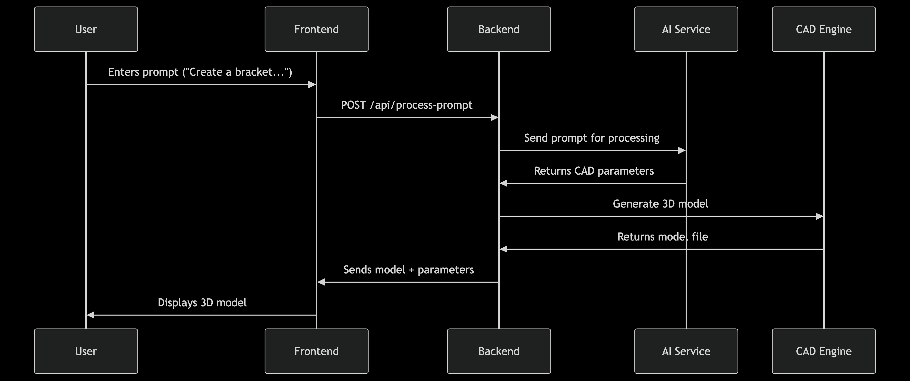

# **AI-Powered CAD Assistant - Comprehensive Documentation**  

## Visit Our GitHub Repository to view the Code Implementation: [CADAssist](https://github.com/fromjyce/CADAssist)

## **1. Introduction**  
The **AI-Powered CAD Assistant** is a web-based application that transforms natural language prompts into fully editable 3D models compatible with popular CAD software (e.g., Autodesk Fusion 360, SolidWorks). It leverages AI to interpret design intent, generate parametric models, and allow real-time modifications through conversational commands.  

### **Key Features**  
✅ **Natural Language to CAD** – Convert text/voice prompts into 3D models  
✅ **Parametric Editing** – Modify dimensions, constraints, and features in real-time  
✅ **Multi-CAD Export** – Supports STEP, STL, IGES, OBJ, and direct CAD integrations  
✅ **Version Control** – Track changes and revert to previous model states  
✅ **AI-Powered Refinement** – Clarify ambiguous prompts and suggest optimizations  
✅ **Collaboration Tools** – Share, comment, and co-edit models with team members  

---

## **2. System Architecture**  

### **Frontend (Next.js + Tailwind CSS)**  
- **Framework**: Next.js 14 (App Router)  
- **UI Library**: Tailwind CSS + ShadCN for components  
- **3D Rendering**: Three.js + `react-three-fiber` + `drei`  
- **State Management**: Zustand (for global CAD model state)  
- **AI Interface**: OpenAI API (GPT-4) for prompt processing  
- **Real-Time Updates**: WebSockets for collaborative editing  

### **Backend (Python + FastAPI)**  
- **Framework**: FastAPI (RESTful API)  
- **CAD Engine**: Open CASCADE (PythonOCC) for geometric modeling  
- **AI Integration**: Fine-tuned LLM for CAD-specific parameter extraction  
- **Database**: PostgreSQL (for user projects & version history)  
- **File Storage**: AWS S3 (for model exports & temporary files)  

### **AI & CAD Processing Pipeline**  
1. **User Input** → Natural language prompt (text/voice)  
2. **AI Processing** → GPT-4 extracts parameters (dimensions, constraints)  
3. **CAD Generation** → Open CASCADE creates parametric model  
4. **Real-Time Preview** → Three.js renders model in browser  
5. **Modification Handling** → AI updates model based on follow-up prompts  
6. **Export** → Convert to STEP, STL, or direct CAD plugin integration  

---

## **3. Tools & Technologies Used**  

| **Category**       | **Tools**                                                                 |
|--------------------|--------------------------------------------------------------------------|
| **Frontend**       | Next.js, Tailwind CSS, Three.js, react-three-fiber, Zustand              |
| **Backend**        | FastAPI, PythonOCC (Open CASCADE), PostgreSQL, AWS S3                    |
| **AI/ML**          | OpenAI GPT-4, Custom fine-tuning for CAD parameters                      |
| **DevOps**         | Docker, GitHub Actions, Vercel (Frontend), Render (Backend)              |
| **CAD Integration**| Autodesk Fusion 360 Plugin, SolidWorks API, STEP/IGES file export        |

---

## **4. Integration with CAD Software**  

### **Option 1: File Export (STEP, STL, IGES, OBJ)**  
- **Supported Formats**:  
  - **STEP (.stp)** – Best for CAD editing (Autodesk, SolidWorks)  
  - **STL (.stl)** – For 3D printing  
  - **IGES (.igs)** – Legacy CAD compatibility  
  - **OBJ (.obj)** – For rendering/visualization  

- **How to Use**:  
  1. Generate model in the web interface.  
  2. Click **Export** → Select format (STEP recommended for CAD).  
  3. Download and import into your CAD software.  

### **Option 2: Direct CAD Plugin (Autodesk Fusion 360 / SolidWorks)**  
- **Fusion 360 Plugin**:  
  - Install from Autodesk App Store.  
  - Log in with your AI-CAD Assistant account.  
  - Sync models directly into Fusion 360 workspace.  

- **SolidWorks Integration**:  
  - Uses SolidWorks API to push models via **Add-In**.  
  - Supports parametric updates from the web interface.  

### **Option 3: API for Enterprise (Custom Workflows)**  
- **REST API Endpoints**:  
  - `POST /api/generate` – Send prompt, get CAD model.  
  - `PATCH /api/modify` – Update model with new instructions.  
  - `GET /api/export` – Retrieve model in desired format.  

---

## **5. User Guide**  

### **Step 1: Creating a Model**  
1. Enter a prompt (e.g., *"Design a 50mm x 30mm L-bracket with 5mm thickness"*).  
2. AI generates a preview with editable parameters.  
3. Tweak dimensions manually or via follow-up prompts.  

### **Step 2: Modifying a Model**  
- **Text Command**: *"Increase length by 10mm and add 3 holes on the side."*  
- **Manual Edit**: Adjust sliders in the **Parametric Controls** panel.  

### **Step 3: Exporting to CAD**  
- **For Editing**: Export as **STEP (.stp)** → Open in Fusion 360/SolidWorks.  
- **For 3D Printing**: Export as **STL (.stl)** → Slice in Cura/PrusaSlicer.  

### **Step 4: Collaboration Features**  
- **Share**: Generate a link for team members to view/edit.  
- **Version History**: Roll back to previous designs.  

---

## **6. Future Roadmap**  
- **AI-Assisted Optimization** (Weight reduction, stress analysis)  
- **Augmented Reality (AR) Preview** (View models in real-world scale)  
- **Multi-Material Support** (Assign different materials to parts)  
- **Cloud Rendering** (High-quality renders via GPU servers)  